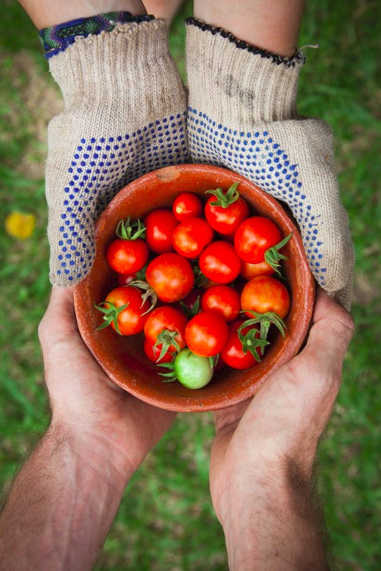
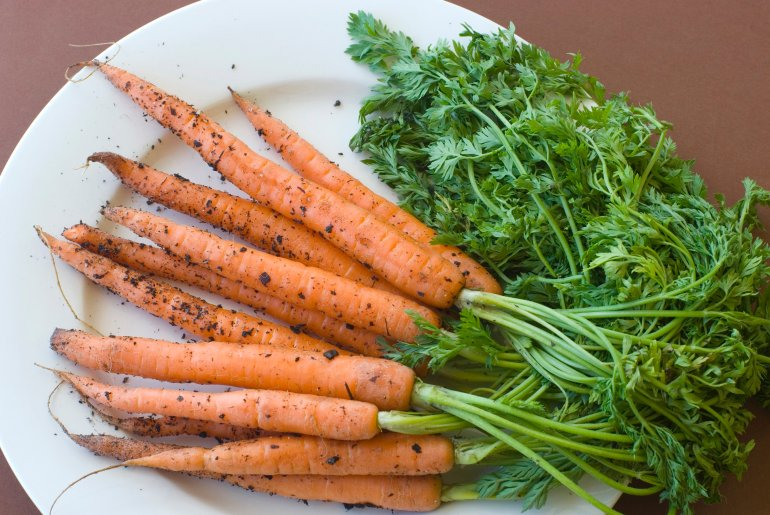
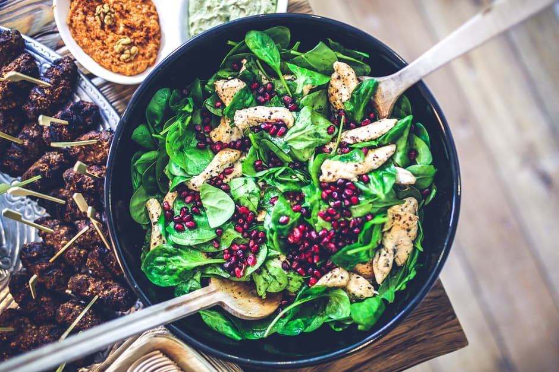

# Sources

> This file lists all sources for the images and graphics used in the app

## Images

- sharing-tomatoes.jpg
  - source: [Pexels](https://www.pexels.com/photo/red-tomatoes-on-brown-bowl-89852/)
  - original name: pexels-photo-89852.jpeg
  - license: Creative Commons Zero (CC0) license

- smiling-woman.jpg
  - source: [Pexels](https://static.pexels.com/photos/38554/girl-people-landscape-sun-38554.jpeg)
  - original name: girl-people-landscape-sun-38554.jpeg
  - license: Creative Commons Zero (CC0) license

- fresh-carrots.jpg
  - source: [Free Food Photos](http://www.freefoodphotos.com/imagelibrary/vegetables/slides/fresh_carrots.html)
  - original name: fresh_carrots.jpg
  - license: Creative Commons Attribution license (freefoodphotos.com)

- healthy-salad.jpg
  - source: [Pexels](https://static.pexels.com/photos/5938/food-salad-healthy-lunch.jpg)
  - original name: food-salad-healthy-lunch.jpg
  - license: Creative Commons Zero (CC0) license
